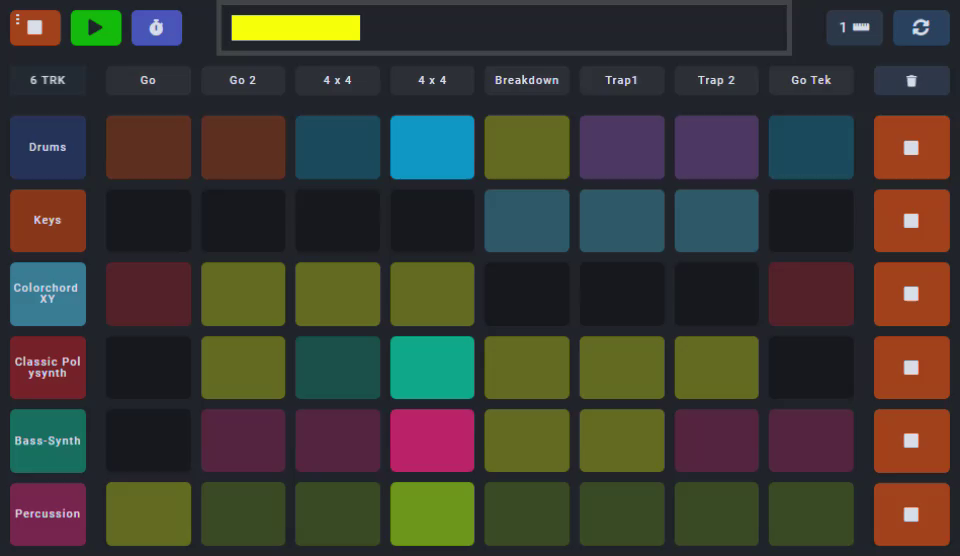

# EOM Control Surface
## Description
This is a set of files for configuring [Open Stage Control](https://openstagecontrol.ammd.net/), which then provides a browser app to control clips in [Bitwig Studio](https://www.bitwig.com/). For example, this can revive an old tablet to be a live looping control tool.

The communication between [Open Stage Control](https://openstagecontrol.ammd.net/) and Bitwig is accomplished with the [Open Sound Control](https://en.wikipedia.org/wiki/Open_Sound_Control) (OSC) protocol. Bitwig Studio needs the [DrivenByMoss](http://www.mossgrabers.de/Software/Bitwig/Bitwig.html) extension, which (among other things) provides a OSC implementation to interface with Bitwig Studio. So, communications are bidirectional between:

Browser (HTTP) <-> (HTTP) Open Stage Control (OSC) <-> (OSC) DrivenByMoss <-> Bitwig Studio.

The EOM Control Surface app can potentially be configured to communicate with other OSC interfaces for other DAWs.

The app UI adapts to the display dimensions both vertically and horizontally.

## Features
- Play, Stop buttons
- Beats indicator (recognizes time signature)
- Scene launch buttons (with names)
- Track selection buttons (with names and colors)
- Track stop buttons
- Clips button grid: Launch, Record (with fixed dureation)
   - If tapped, when:
      - empty -> starts clip recording
      - stopped -> starts clip playing
      - recording -> starts clip re-recording
      - playing -> starts clip recording
- Delete clip
- Buttons for selecting clips record duration
- Sync all clips slot state button
- Configurable number of tracks (1 to 8)

## How to install
- Install Open Stage Control
   - These instructions assume you install it on the same computer that of the DAW, Let's call it "main PC".
   - Download session and module files from this repository: "eom-control-surface.json" and "osc-filter-module.js".
   - Install the software and run it.
   - Configure Open Stage Control:
     - send: 127.0.0.1:8200 (the port where Bitwig/DrivenByMoss receives commands)
     - port: 8080 (the port where the web app will be served)
     - no-gui: true (so no webapp will be lauched when the web server start, since we will use a browser)
     - load: control-surface.json (point to the file you downloaded from this repo)
     - custom-module: osc-filter-module.js (point to the file you dowloaded from this repo)
     - osc-port: 9000 (the port where Open Stage Control listens to OSC commands)
   - Start Open Stage Control
   - On the bottom part of the window it will print how you can access it from a browser.
- Test browser app
   - First, try on the main PC using a browser to access: http://127.0.0.1:8080
   - If it works, try on another computer or tablet on your local network. But there, you'll need to use the name or the IP of the main PC on the network, like http://mycomputer:8080. You'll need to research how to get that name or IP, because it depends on your setup.
- Install DrivenByMoss in Bitwig Studio.
   - Configure the "Open Sound Control" provided:
     - Port to receive on: 8200 (port where DrivenByMoss receives OSC commands from Open Stage Control)
     - Port to send to: 9000 (port where DrivenByMoss sends OSC commands to Open Stage Control)
- Have fun!
  - The app should now be communicating with BitWig.
